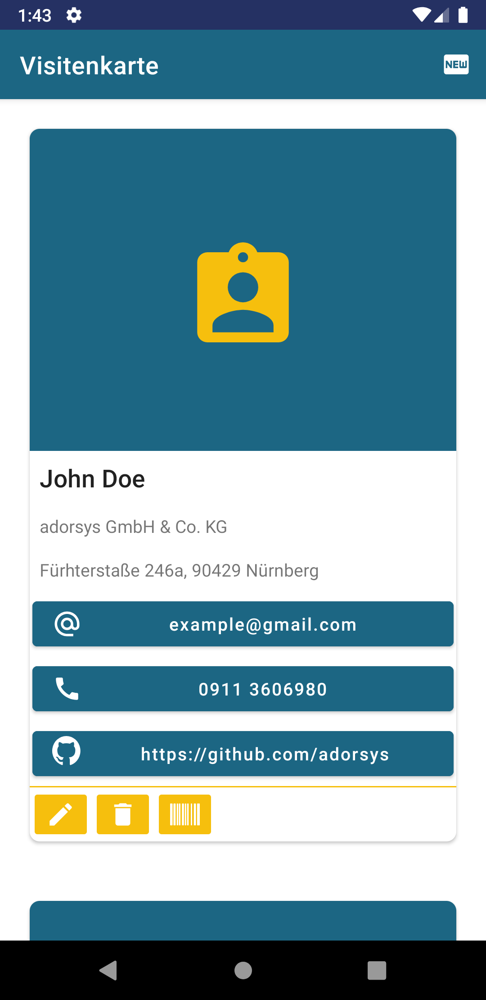
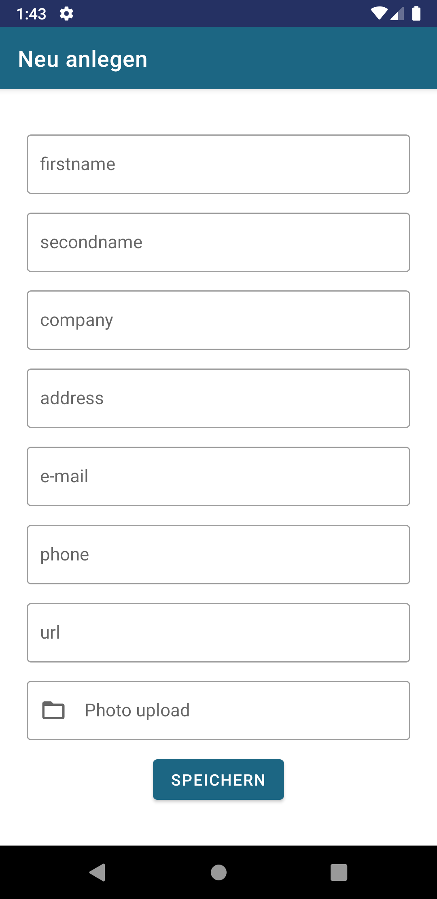
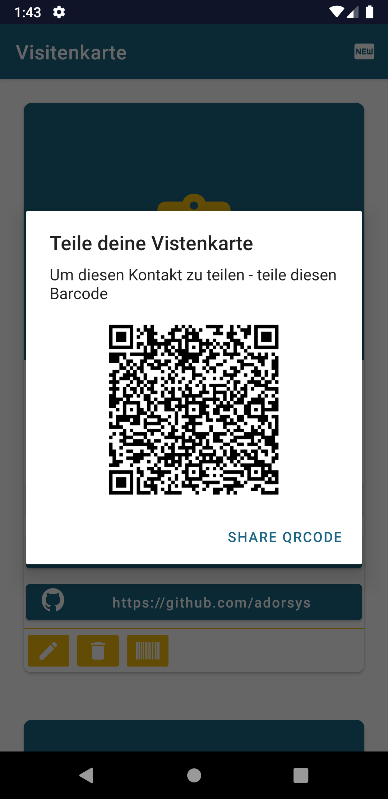

# Business-Card-App

 
 
 

 

The app helps you to manage your business cards, you can create new ones or edit existing ones.
It is very easy to share business cards with colleagues and friends via qr-code.

## Getting Started

- create your own firestore and put the google-service.json in the app directory [let's start](https://firebase.google.com/docs/firestore)
- install app and create bussiness-cards
- share your business card with friends

#### Share your businesscard with friends
 

| maintain       | create/edit           | share QR Code  |
| ------------- |:-------------:| -----:|
|      |  | |

#### Libaries used
- [Firebase Firestore](https://firebase.google.com/docs/firestore)
- [ZXing](https://github.com/journeyapps/zxing-android-embedded)
- [vCard](https://github.com/RurioLuca/QrCardParsing)

### Written by

Isabella Caspari

